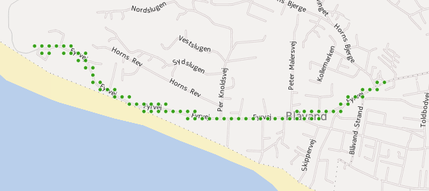

# Computing K-density using grids

Problem: Given a uniform grid of cells, find all cells intersecting more than *K* features.


## Approach

1. For all records: Use [ST_Cellify](../stored_procedures/st_cellify.md) to compute the set of intersected tile cells, using a point to represent each cell (see image below)
2. Convert points to a unique string using [ST_PointHash()](../stored_procedures/st_pointhash.md), and output a *record_id, cell_id* tuple for each cell that the record intersects
3. Group the tuples by cell_id and find all groups where count(*) > K



At this stage do one of the following. For each cell_id where count(*) > K:

* Create all possible K+1-sized sets of tuples where cell-id=cell-id, and delete one record from each set (solve hitting set)
* Create one set of records for each cell_id (say a set of K' records, where K' > K), and delete K' - K records from each set.

Using the first approach is more consistent with the general approach, while the second one might perform better.

## Connection to MapReduce

This way of formulating the problem is very suitable for solving with map-reduce. Computing cell-ids can be done independently for each record. Finding cells with more than K records (and outputting K-sets or records) can be done independently for each cell-id.

* **Map**: Map over records and emit a pair *(cell-id, record-id)* for each cell intersected by a given record
* **Reduce**: Loop over *(cell-id, record-id)* pairs and collect all tuples where the cell-id occurs more than K times in the stream. Output K-sets or records from the collected tuples grouped by *cell-id*.

## Experiments with running time (not mapreduce)

Using OpenStreetMap streets in the Copenhagen region (57,812 records). There is a GIST index on wkb_geometry.

### Computing the cells

The SELECT template for computing *cell-id,record-id* pairs for a given *cell_size*:

```sql
SELECT 
	ST_PointHash(ST_Cellify(wkb_geometry, {cell_size}, 0, 0)) AS cell_id, 
	ogc_fid AS record_id
FROM cph_highway;
-- For cell_size = 100 meter
-- Total query runtime: 453740 ms. 7-8 minutes for 57,812 records
-- 382611 rows retrieved.
-- 1.2 ms per row
-- 7.8 ms per record
```

The running times for different cell-sizes are given below:

<table>
	<tr><th>cell size</th><th>rows retrieved</th><th>total running time</th><th>time per record (58K records total)</th></tr>
	<tr><td>100 meter</td><td>382611</td>        <td>7-8  minutes</td>      <td>7.8 ms/record</td></tr>
	<tr><td>200 meter</td><td>208562</td>        <td>2-3 minutes</td>       <td>2.3 ms/record</td></tr>
	<tr><td>400 meter</td><td>122803</td>        <td>1 minute</td>          <td>0.9 ms/record</td></tr>
    <tr><td>600 meter</td><td>95669</td>         <td>30 seconds</td>        <td>0.6 ms/record</td></tr>
    <tr><td>800 meter</td><td>82923</td>         <td>26 seconds</td>        <td>0.5 ms/record</td></tr>
    <tr><td>1000 meter</td><td>75666</td>         <td>22 seconds</td>       <td>0.4 ms/record</td></tr>
    <tr><td>1200 meter</td><td>71119</td>         <td>21 seconds</td>       <td>0.4 ms/record</td></tr>
</table>

As can be seen, the running time drops (predictably) as the cell-size increases:


### Finding cells that intersect more than K records

The SELECT template for finding all cells that intersect more than *K* records (substitute placeholders CELLSIZE and K in the statement below):

```sql
SELECT 
	c.cell_id, 
	count(c.*) as num_recs 
FROM
(SELECT 
	ST_PointHash(ST_Cellify(wkb_geometry, CELLSIZE, 0, 0)) AS cell_id
FROM cph_highway) c
GROUP BY c.cell_id
HAVING count(*) > K;
``` 

Especially for small cell-sizes, the total running time is dominated by computing *ST_Cellify()*.

### Back-of-the-envelope: Scalability

What is the estimated running time for ST_Cellify given 100 m cells, in a scenario with 40 million street records?

At an estimated 7.8 ms per record, it would take 86 hours. Not so good... The positive side is that ST_Cellify is highly parallelizable (MapReduce).

## Full example


Find *id* of records to delete. The example uses the cph_highway dataset, and computes the result for the *type='residential'* partition at *zoom-level=15* (where cell-size is 1222.9924523925781 meters, computed using [meter_per_pixel_3857](../../python_wiki/meter_per_pixel.md)) and for cell-bound *K=16*.

### Computing records directly without hitting set step

In this example In statement below, do the following replacements (to make it work with 'cph_highway'):

* *TABLE_OUT* with *cph_highway_cvlized*
* *Z* with *15*
* *ID* with *ogc_fid*
* *THE_GEOMETRY* with *wkb_geometry*
* *PARTITION* with *residential*
* *TEMP_SERIAL* with *1*
* *CELLSIZE* with *1222.9924523925781* (zoomlevel 15)
* *X0* with *-20037508.34*
* *Y0* with *-20037508.34*
* *K* with *16*.

temp tables name should perhaps just be 'cvl_tmp_' postfixed with *1, 2, 3, ...*

```sql
-- drop temp table if exists...
DROP TABLE IF EXISTS cvl_tmp_{TEMP_SERIAL};

-- create temp table with cell-id for all records at zoom-level 15
CREATE TEMPORARY TABLE cvl_tmp_{TEMP_SERIAL} AS 
SELECT 
	ST_PointHash(ST_Cellify({THE_GEOMETRY}, ST_CellSizeZ( {Z} ), {X0}, {Y0)})) AS cell_id,
	{ID} AS record_id,
	rank AS record_rank
FROM cph_highway
WHERE partition={PARTITION}
AND tile_level={Z};

-- Find records to delete
WITH conflicts AS
(
	SELECT cell_id
	FROM cvl_tmp_{TEMP_SERIAL}
	GROUP BY cell_id
	HAVING count(*) > {K}
)
SELECT DISTINCT t.record_id -- DELETE THESE RECORDS
FROM
(
	SELECT 
		row_number() OVER (PARTITION BY cell_id ORDER BY record_rank DESC) r, 
		* 
	FROM cvl_tmp_{TEMP_SERIAL}
	WHERE 
		cell_id IN (select * from conflicts)
) t
WHERE t.r > {K};
-- Total query runtime: 8162 ms.
-- 6737 rows retrieved.
```

That takes 8 seconds. It skips the hitting set step, and computes the records to delete directly. Note that the DISTINCT is not really necessary and omitting it may save a little bit of time (probably very little).

Of course a generated query could not know that there is a partition called residential, but somehow that information should be entered.

### Computing via hitting sets

TODO

## An experiment: Double *cell-size* and quadruple *K*

As an experiment, I tried doubling the cell-size and quadrupling the K, to see if this was a good approxmation for result achieved using half the cell-size. It isn't (might work for points):

Using *cell-size* = *200* *m* and *K* = *4*:

```sql
SELECT 
	c.cell_id, 
	count(c.*) as num_recs 
FROM
(SELECT 
	ST_PointHash(ST_Cellify(wkb_geometry, 200, 0, 0)) AS cell_id
FROM cph_highway) c
GROUP BY c.cell_id
HAVING count(*) > 4;
-- Total query runtime: 135977 ms.
-- 7441 rows retrieved.
```

Using *cell-size* = *400* *m* and *K* = *16*:

```sql
SELECT 
	c.cell_id, 
	count(c.*) as num_recs 
FROM
(SELECT 
	ST_PointHash(ST_Cellify(wkb_geometry, 400, 0, 0)) AS cell_id
FROM cph_highway) c
GROUP BY c.cell_id
HAVING count(*) > 16;
-- Total query runtime: 49926 ms.
-- 378 rows retrieved.
```

### Conclusion

It does not work for record set = OSM streets, i.e. LineStrings. The first query selects 7441 rows, while the second selects 378 rows. 7441/4 = 1,860.25. I hoped it would be near to 378. It might work for points though.


